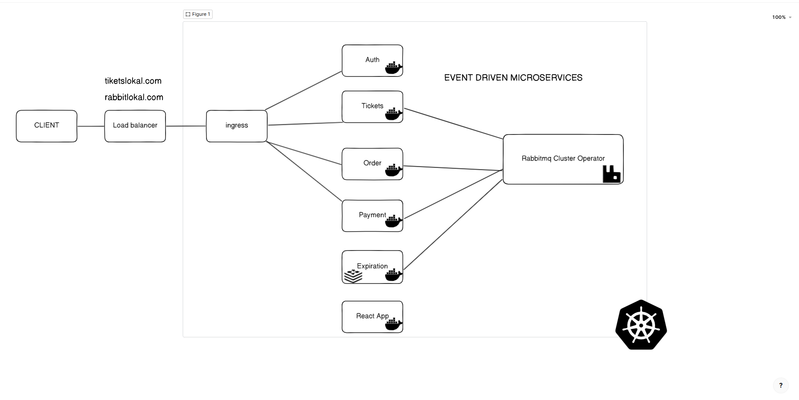
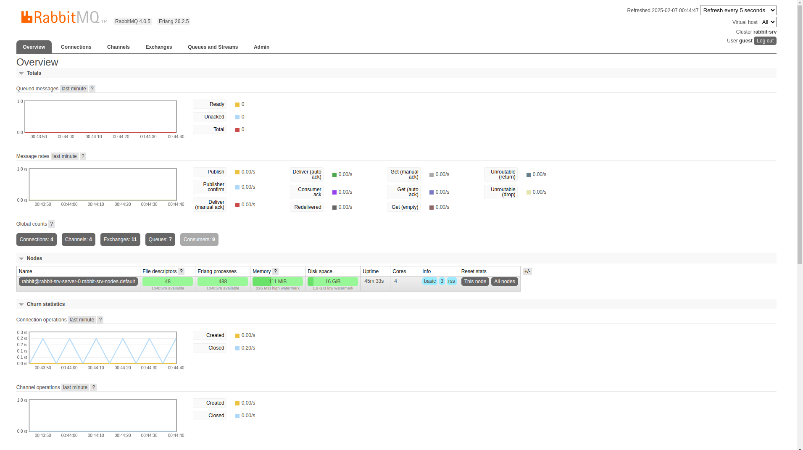

# Event-Driven Scalable Microservices Ticket System

# About the App:
This App is a ticket system based on event driven microsrvices. When buying a ticket (creating an order), the ticket will be reserved for 2mns (simulation, but can be up to 15mns). If no payment made, the ticket will be available again but if purchased successfully the ticket is removed from the UI.

# Features:
##### - Auth microservice;
##### - Ticket microservice;
##### - Order microservice;
##### - Expiration microservice (Redis & Bull to expire an order if time limit is reached);
##### - Payments microservice (with Stripe);
##### - Client microservice with React;

# Technologies:
#### - Kubernetes, Docker, Ingress, Rabbitmq Cluster Operator, Nodejs, Typescript, Mongodb, Express, Redis, BullJS, Stripe, Amqplib, common NPM package @eftickets/common, Json Web Token, Cookie, React, Material UI (MUI),Context Api, Custom hooks, Design patterns, CRUD & validation, Authentication, Authorization, Skaffold.

###### - Change Order expiration limit: const EXPIRATION_WINDOW_SECONDS = 2 * 60 to const EXPIRATION_WINDOW_SECONDS = 15 * 60 in production

